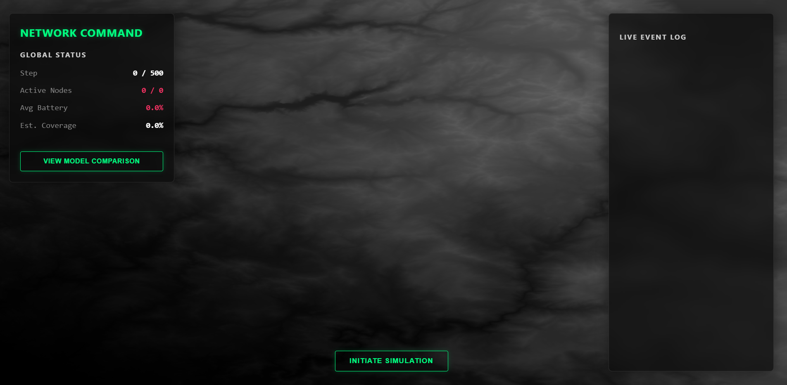
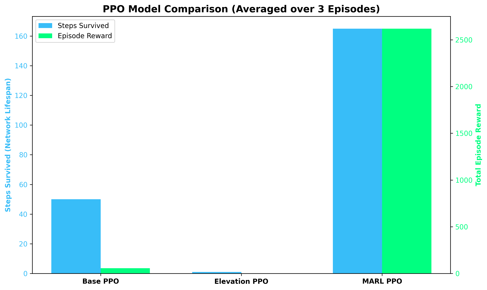

# Energy-Efficient RL Sensor Network



A full-stack Multi-Agent Reinforcement Learning (MARL) project aimed at maximizing the network lifetime and coverage efficiency of a Wireless Sensor Network (WSN) deployed over real-world terrain.

## 🚀 Overview

Wireless Sensor Networks are often deployed in inaccessible, hazardous environments where recharging batteries is impossible. The primary challenge is maximizing the **coverage lifespan** of the network without exhausting power too early. Traditional rule-based heuristics struggle to adapt to the highly complex, non-linear effects of terrain elevation, shadowing, and dynamic overlapping coverage.

This project tackles the challenge by framing it as a decentralized MARL problem. Each sensor acts autonomously, learning exactly when to boost its transmit power (to cover for dead neighbors) and when to sleep (to conserve battery and avoid wasted signal overlap).

### Features
- **Real-World Topography**: Ingests realistic `.tif` satellite elevation data (e.g. USGS GeoTIFF) to accurately model line-of-sight and terrain traversal.
- **MARL Difference Rewards**: Solves the Multi-Agent Credit Assignment problem and prevents "Free Riders" by rewarding sensors based on their marginal contribution to the global coverage grid.
- **Stable-Baselines3 & PettingZoo**: Leverages industry standard vectorization via `SuperSuit` to parallelize environment steps for massive PPO throughput.
- **Neon Tactical Dashboard**: A real-time, glassmorphic React dashboard streaming the live PettingZoo simulation states through FastAPI WebSockets.

---

## 📐 The RL Architecture & Math

We approach this as a **Decentralized Partially Observable Markov Decision Process (Dec-POMDP)**.

### State Space (Observation)
Each sensor $i$ observes an 11-dimensional vector at step $t$:
$$ O_i^t = [ E(x, y)_{3 \times 3}, \frac{B_i^t}{B_{max}}, N_{active} ] $$
- **$E(x, y)_{3 \times 3}$**: A 9-dimensional normalized 3x3 patch of the local terrain elevation around the sensor.
- **$B_i^t$**: The current battery percentage (0.0 to 1.0).
- **$N_{active}$**: The normalized count of neighboring sensors currently transmitting.

### Action Space
Each agent outputs a continuous action mapped to transmit power:
$$ A_i^t \in [0.0, 1.0] $$
Higher power increases the effective coverage radius but drains the battery exponentially faster.

### The Multi-Agent Reward Function
The ultimate goal is to maximize the Global Coverage $C(S)$ over the maximum number of steps while minimizing battery drain. However, standard team rewards drown individual agent contributions in noise. 

We solve this using **Difference Rewards (Marginal Contribution)**:
$$ R_i^t = \left( C(S) - C(S_{-i}) \right) - \lambda (A_i^t)^2 $$
Where:
- $C(S)$ is the total terrain area covered by all active sensors.
- $C(S_{-i})$ is the counterfactual coverage if agent $i$ had output 0 power.
- $\lambda (A_i^t)^2$ is the quadratic penalty for draining battery power.

This ensures every sensor gets an exact gradient signal on whether its specific transmission actually contributed new coverage, or if it was just redundantly overlapping with a neighbor!

---

## 📊 Iterative Results

We progressed through three distinct architectures:
1. **Base PPO (`SensorEnv`)**: Single-agent perspective, ignored terrain. Stuggled to optimize coverage efficiently.
2. **Elevation-Aware PPO (`ElevationSensorEnv`)**: Introduced terrain data into the observation space. Improved energy management but suffered from overlapping signal waste.
3. **Independent PPO (IPPO/MARL)**: Framed via PettingZoo (`MultiAgentSensorEnv`). Sensors learned to dynamically negotiate coverage. Some sensors learned to act as "Anchors" (sleeping to save battery) while others drained early to establish immediate coverage.



*The MARL model massively outperformed single-agent baselines in extending the network lifespan.*

---

## 🛠️ Project Structure

The project has been professionally organized into a modular architecture:

- **`agents/`**: Core training algorithms (`train_marl.py`, `evaluate_marl.py`).
- **`environment/`**: Gymnasium and PettingZoo environment definitions (`multi_agent_sensor_env.py`).
- **`models/`**: The saved `.zip` files for our trained PPO and DQN networks.
- **`data/`**: The USGS data loader (`usgs_loader.py`) and `.tif` files.
- **`server/`**: The FastAPI backend (`main.py`) which streams simulation frames via WebSockets.
- **`frontend-react/`**: The React + Vite frontend for visualizing the agent behavior.
- **`logs/`**: Tensorboard histories.
- **`scripts/`**: Development debugging scripts.

---

## ⚙️ Running the Project

### 1. Backend Server (FastAPI)
The backend loads the trained IPPO model and streams the simulation to the frontend.
```bash
# In one terminal
pip install -r requirements.txt
uvicorn server.main:app --reload
```

### 2. Frontend Dashboard (React/Vite)
The frontend connects to `ws://localhost:8000/ws/simulate` to render the canvas.
```bash
# In a second terminal
cd frontend-react
npm install
npm run dev
```

Open your browser to `http://localhost:5173` and click **Initiate Simulation** to watch the agents optimize their battery drain in real-time!
